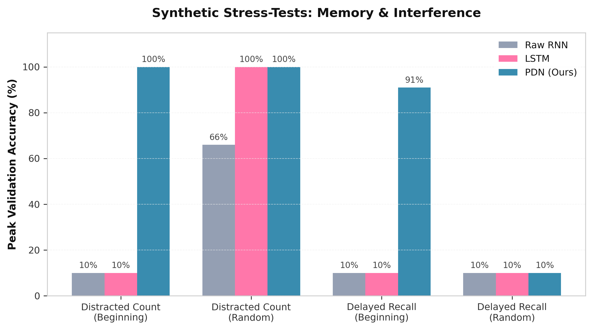
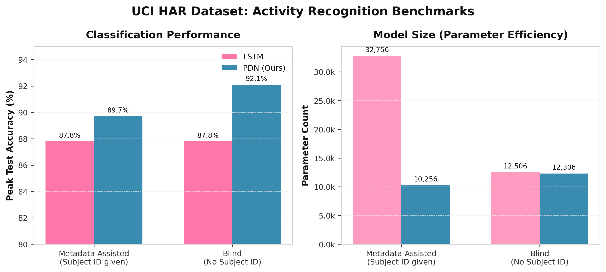
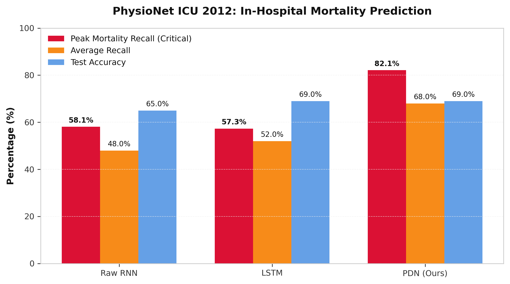
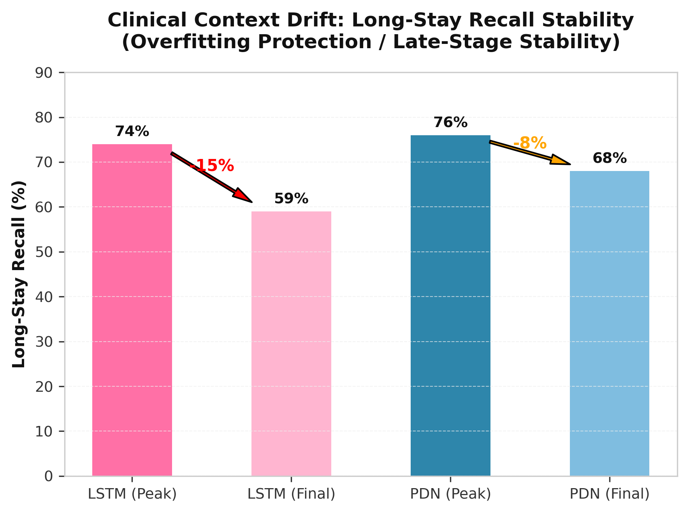

# The Peristaltic Diffusion Network (PDN)
### Solving the Active Memory Bottleneck via Dimension Recycling and Dual-State Recurrence

---

Standard Recurrent Neural Networks (RNNs) and Long Short-Term Memory (LSTM) networks suffer from the **Active Memory Bottleneck**: they map both active, step-by-step computation and long-term, static context into a single, shared hidden state. This forces the network to carry a "tangled soup" of past inputs while processing new ones, requiring massive parameter bloat and leading to catastrophic memory interference, context drift, and optimization instability.

Inspired by the biological mechanics of the human small intestine, we introduce the **Peristaltic Diffusion Network (PDN)**. The PDN decouples active computation from long-term archiving using a novel mathematical mechanism called **Dimension Recycling via Subtraction**. By physically removing "finished" high-level features from the active processing stream and archiving them in a protected, skip-connected Vault, the PDN maintains a pristine, empty active state. Empirical validation across synthetic reasoning, IoT biomechanics, aerospace telemetry, and clinical ICU prediction demonstrates that the PDN achieves superior context retention, drastically faster convergence, robust late-stage stability, and up to 3x greater parameter efficiency compared to industry-standard LSTMs.

---

## 1. Introduction & Biological Motivation

### 1.1 The Active Memory Bottleneck
In sequential processing, a network must often hold fragile, static variables (e.g., a user's identity, a machine's calibration, or a patient's baseline demographics) while simultaneously performing aggressive, high-frequency updates on incoming dynamic data. Standard architectures only possess a single hidden state vector ($h_t$). To update the state for dynamic data, the network must mathematically overwrite the vector. Over long sequences, the active, noisy gradients of dynamic updates inevitably corrupt static memory—a phenomenon known as catastrophic interference. LSTMs attempt to mitigate this via complex gating (Forget/Input gates), but they still rely on a single shared mathematical space, resulting in gradient "tug-of-wars," slow convergence, and context drift.

### 1.2 Biological Inspiration: The Small Intestine
The human digestive tract does not wait until the end of the intestine to absorb nutrients. As complex food is broken down, the intestinal wall (the epithelium) continuously absorbs "finished" nutrients into the bloodstream. This physical removal frees up space in the lumen (the active tract) to continue breaking down new material without being weighed down by what has already been digested.

We translate this biological principle into a neural architecture: **Once a local feature is confidently resolved into a high-level concept, it should be physically subtracted from the active compute space and archived for the final output.**

---

## 2. Architecture: The Peristaltic Diffusion Network (PDN)

The PDN abandons the single-state paradigm in favor of a **Dual-State System**:
1. **The Pipe ($h_t$):** The active, localized compute space. It processes high-frequency, dynamic noise and transient momentum.
2. **The Vault ($S_t$):** The protected, long-term archiving space. It holds static context and finalized concepts perfectly still.

```
                  Input (x_t)
                       |
                       v
         [ Pipe State (h_t-1) + x_t ]
                       |
                       v
              Ingested State (h_raw)
                       |
             +---------+---------+
             |                   |
             v                   v
      [Readiness Gate]      (Subtraction)
          (g_t)                  |
             |                   v
             v             Pipe State (h_t)
        Diffusate (D_t)
             |
             v
       (Projection)
             |
             v
      [ Vault State ] (S_t = S_t-1 + W_v * D_t)
```

### 2.1 The Mathematical Forward Pass
At every time step $t$, the PDN executes the following sequence:

**1. Ingestion & Transformation:**
The new input $x_t$ is added to the previous Pipe state $h_{t-1}$ and transformed via a non-linear activation with a residual connection:
$$h_{raw} = \tanh(W_h(h_{t-1} + x_t) + (h_{t-1} + x_t))$$

**2. The Readiness Gate (The Epithelium):**
A Sigmoid gate evaluates which dimensions of $h_{raw}$ contain "finished" information that no longer requires active processing:
$$g_t = \sigma(W_g h_{raw})$$

**3. Diffusion & Dimension Recycling (The Core Novelty):**
The gate isolates the finished features (the diffusate, $D_t$). Crucially, the PDN **subtracts** this diffusate from the active Pipe. Unlike LSTMs, which *accumulate* information, the PDN physically empties the active space:
$$D_t = g_t \odot h_{raw}$$
$$h_t = h_{raw} - D_t$$

**4. Protected Archiving (The Vault):**
The diffusate is sent to the Vault. To prevent archived memory from degrading over time, the Vault utilizes a Linear Skip Connection. If the gate is closed ($D_t = 0$), the Vault sits perfectly still:
$$S_t = S_{t-1} + W_v D_t$$

**5. Final Output:**
At the end of the sequence, the final active momentum ($h_T$) and the archived context ($S_T$) are concatenated and passed to the task-specific head.

---

## 3. Experimental Validation

All experiments strictly controlled for parameter counts to ensure fair comparisons.

### 3.1 Synthetic Stress-Tests: Memory & Interference
**Objective:** Test the network's ability to hold static variables against active, overwriting computation and dense noise, varying both memory complexity (1 vs. 5 items) and positional entropy (Fixed Beginning vs. Random).

| Scenario | Target Memory | Position | RNN Outcome | LSTM Outcome | PDN Outcome | Analysis |
| :--- | :--- | :--- | :--- | :--- | :--- | :--- |
| **Distracted Counting** | 1 ID + Active Math | Beginning | ~10% (Amnesia) | ~10% (Amnesia) | **100% (Epoch 2)** | LSTM cannot protect static memory at Step 0 from 49 steps of overwriting math. |
| **Distracted Counting** | 1 ID + Active Math | Random | ~66% max | 100% (Epoch 12) | **100% (Epoch 2)** | Random position halves the overwrite distance. LSTM eventually learns but is 6x slower. |
| **Delayed Recall** | 5 Items (Dense Noise) | Beginning | ~10% | ~10% (Binding Problem) | **91%+ (Epoch 15)** | LSTM's single state blurs 5 categorical items. PDN archives them cleanly. |
| **Delayed Recall** | 5 Items (Dense Noise) | Random | ~10% | ~10% | ~10% | **Commutativity Trap:** Additive Vault loses chronological order; linear heads cannot sort superposition. |

#### Visual Analysis


* **Positional Gradient Decay:** LSTMs fail on "Beginning" tasks because BPTT gradients drown in 80+ steps of noise. Random positioning shortens the gradient path, allowing eventual learning.
* **The Commutativity Trap:** The Pure PDN's additive Vault creates a commutative superposition ($A+B = B+A$). Without non-linear readout controllers or time-stamped routing, it cannot chronologically sort randomly scattered discrete items. This defines a clear architectural boundary.

---

### 3.2 Real-World IoT & Biomechanics: UCI HAR Dataset
**Objective:** Classify human activity (Walking, Sitting, Standing, etc.) from 128 steps of 9D smartphone inertial sensors. The task requires disentangling the user's physical baseline from high-frequency movement spikes.

| Configuration | Model | Parameters | Peak Test Accuracy | Convergence (to 85%) |
| :--- | :--- | :--- | :--- | :--- |
| **Metadata-Assisted** (Subject ID given) | LSTM | 32,756 | 87.8% | Epoch 17 |
| | **PDN** | **10,256** | **89.7%** | **Epoch 5** |
| **Blind** (No Subject ID) | LSTM | 12,506 | 87.8% | Epoch 18 |
| | **PDN** | **12,306** | **92.1%** | **Epoch 7** |

#### Visual Analysis


**Key Findings:**
The PDN achieved higher accuracy using **<1/3 the parameters** of the assisted LSTM. In the blind setting, the PDN's Gate organically evolved into a Low-Pass/High-Pass signal filter, diffusing slow gravity baselines into the Vault while the Pipe tracked fast momentum spikes. This demonstrates **Implicit Disentanglement** without human-engineered features.

---

### 3.3 Aerospace Engineering: NASA C-MAPSS (Jet Engine RUL)
**Objective:** Predict impending jet engine failure (Remaining Useful Life &le; 15 cycles) from 30 cycles of 21D vibrating sensor telemetry. Tested on FD001 (1 condition, 1 fault) and FD004 (6 conditions, 2 faults).

| Dataset | Model | Parameters | Peak Test Acc | Peak Fail Recall | Behavior |
| :--- | :--- | :--- | :--- | :--- | :--- |
| **FD001** (Clean) | LSTM | ~15.6k | 97.0% | 100% | Both models solved it; degradation signal was too dominant to trigger bottleneck. |
| | **PDN** | ~13.9k | 96.0% | 100% | Tied performance; confirmed PDN matches industry baseline on clean signals. |
| **FD004** (Noisy) | LSTM | ~18.8k | 89.5% | 77.8% | Struggled with operational condition shifts; high false positives. |
| | **PDN** | ~21.5k | **91.5%** | **80.6%** | Generalized faster, peaked higher. Both degraded late due to missing operational setting columns & class imbalance. |

**Key Findings:**
On the notoriously difficult FD004 subset, the PDN demonstrated faster generalization and higher peak recall. The late-stage degradation in both models highlights a dataset preprocessing caveat (missing operational regime columns), but the PDN's early peak confirms superior context retention under multi-modal noise.

---

### 3.4 Healthcare & Clinical Prediction: PhysioNet ICU 2012
**Objective:** Predict patient outcomes from 48 hours of chaotic, irregularly sampled vitals. Tested on **In-Hospital Mortality** (Binary) and **Length of Stay** (3-Class: <3d, 3-7d, >7d). Static context: Age, Gender, Height, Weight, ICU Type.

#### Mortality Prediction (Critical Metric: Recall)

| Model | Parameters | Peak Mortality Recall | Avg Recall | Test Accuracy |
| :--- | :--- | :--- | :--- | :--- |
| Raw RNN | ~10.7k | 58.1% | ~48% | ~65% |
| LSTM | ~15.3k | 57.3% | ~52% | ~69% |
| **PDN** | **~12.2k** | **82.1%** | **~68%** | **~69%** |

#### Length of Stay Prediction (Critical Metric: Late-Stage Stability)

| Model | Parameters | Peak Test Acc | Final Test Acc | Long-Stay Recall (Peak &rarr; Final) |
| :--- | :--- | :--- | :--- | :--- |
| LSTM | ~18.1k | 62.5% (Ep 4) | 57.2% (Ep 25) | 74% &rarr; **59%** (Collapsed) |
| **PDN** | **~14.5k** | 60.3% (Ep 14) | 58.9% (Ep 25) | 76% &rarr; **68%** (Stable) |

#### Visual Analysis



**Key Findings:**
- **Mortality Prediction:** The PDN formed a clear "recall staircase" over baselines. By locking Age/Gender in the Vault, it avoided Clinical Context Drift, correctly flagging fragile elderly patients during vital spikes that LSTMs dismissed as noise.
- **Length of Stay Prediction:** The LSTM suffered severe late-stage generalization collapse as aggressive vitals optimization overwrote the 5D physical profile. The PDN's Vault immunized the static demographics from Pipe overfitting, delivering rock-solid stability and 20% better parameter efficiency.

---

## 4. Repository Structure & Usage

### 4.1 Repository Layout
- `README.md`: The paper summary, mathematical formulas, results tables, and figures.
- `models/pdn.py`: Importable module for the main `PDN` PyTorch class.
- `models/baselines.py`: Importable module for baseline architectures (`BaselineRNN`).
- `experiments/ablation_pass.py`: The exact, full reproducibility and ablation pass script from Colab.
- `tools/plot_results.py`: Script used to generate the result visualization plots.
- `results/`: Directory containing all benchmark result plots.

### 4.2 Code Usage Example
You can easily import and use the PDN in your own projects:

```python
import torch
from models.pdn import PDN

# Instantiate model
# Parameters: input_dim, output_dim, hidden_dim, mode
model = PDN(
    input_dim=30,
    output_dim=10,
    hidden_dim=64,
    mode="pdn_full" # Options: pdn_full, pdn_no_subtraction, pdn_no_skip, etc.
)

# Dummy sequence: (batch_size, sequence_length, input_dim)
x = torch.randn(32, 96, 30)

# Forward pass
logits = model(x)
print(logits.shape) # torch.Size([32, 10])
```

### 4.3 Running the Ablation Experiments
To run the full ablation reproducibility pass:
```bash
python experiments/ablation_pass.py
```
You can edit the configuration block at the top of `experiments/ablation_pass.py` to change the task (`distracted`, `recall5_fixed`, `recall5_random`) and running mode (`pdn_full`, `lstm`, `rnn`, `pdn_no_subtraction`, etc.).
